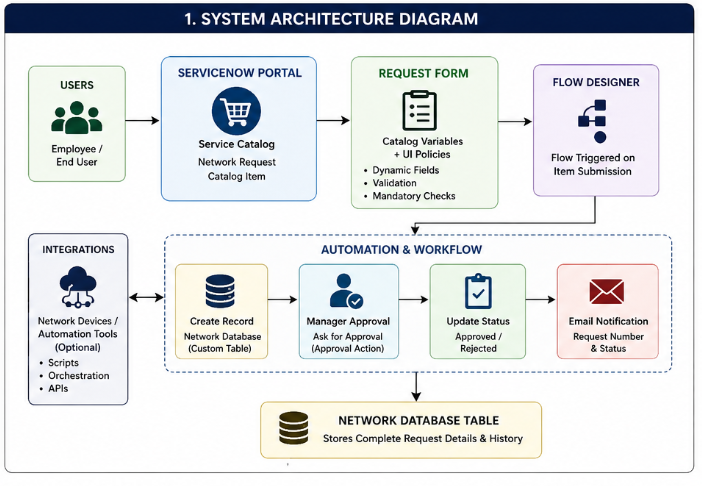
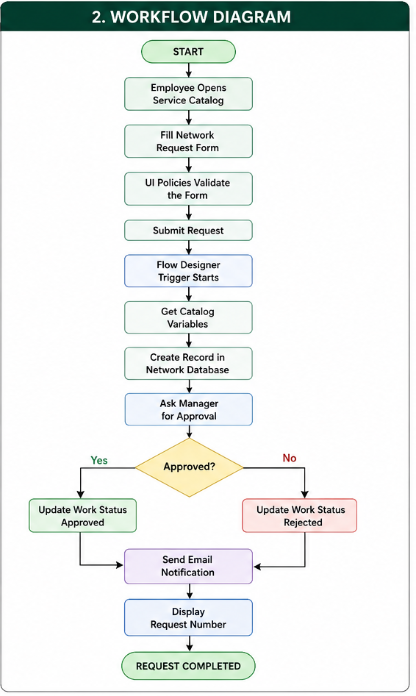

# 🚀 Automated Network Request Management in ServiceNow

## 📌 Project Overview

The **Automated Network Request Management** system is a ServiceNow application designed to automate the lifecycle of network-related service requests. It enables employees to submit requests through a self-service portal while automating approvals, task creation, notifications, and request tracking using ServiceNow's no-code/low-code capabilities.

---

## 🎯 Problem Statement

Organizations often manage network requests manually, resulting in delays, inconsistent approvals, and limited visibility into request status. This project addresses these challenges by providing an automated, centralized solution built on the ServiceNow platform.

---

## 🎯 Objectives

- Automate network request handling
- Reduce manual effort
- Improve SLA compliance
- Provide real-time request tracking
- Enhance user experience through self-service

---

## ✨ Key Features

- Self-Service Service Catalog
- Dynamic Catalog Forms using UI Policies
- Automated Flow Designer Workflow
- Approval Process
- Email Notifications
- Custom Network Database Table
- Request Tracking
- Improved SLA Compliance

---

## 🛠 Technology Stack

| Component | Technology |
|-----------|------------|
| Platform | ServiceNow Zurich |
| Catalog | Service Catalog |
| Automation | Flow Designer |
| Database | Custom Network Database Table |
| Workflow | Approval Engine |
| Notifications | Email Notifications |
| UI | Catalog Variables & UI Policies |

---

# 🏗️ System Architecture

The **Automated Network Request Management** solution follows a request-driven architecture built using ServiceNow's Service Catalog, Flow Designer, UI Policies, and a custom database table. The architecture automates the complete lifecycle of a network request—from user submission to approval, record management, and notification—without requiring manual intervention.

## Architecture Diagram

## Component Description

| Component | Description |
|-----------|-------------|
| **Employee/User** | Submits a network request using the Service Catalog. |
| **Service Catalog** | Provides the Network Request form for users to submit requests. |
| **Catalog Variables** | Collect requester information, device details, and request-specific inputs. |
| **Catalog UI Policies** | Dynamically show or hide fields based on user selections to improve usability. |
| **Flow Designer** | Automates request processing, approvals, notifications, and record updates. |
| **Network Database Table** | Stores all submitted network requests and tracks their status. |
| **Approval Engine** | Routes requests to the appropriate approver for authorization. |
| **Email Notification** | Sends automatic emails to requesters with status updates and request details. |

## How the Architecture Works

1. Users submit a network request through the Service Catalog.
2. Catalog Variables capture the required information.
3. UI Policies dynamically adjust the form based on user input.
4. Flow Designer is triggered automatically after submission.
5. A new record is created in the custom Network Database table.
6. The request is routed for approval.
7. After approval or rejection, the request status is updated.
8. Email notifications are sent automatically to the requester.
9. All request data is stored for tracking, reporting, and auditing.
---

# 🔄 Workflow

The workflow is fully automated using **ServiceNow Flow Designer**. Once a user submits a network request through the Service Catalog, the system automatically validates the request, creates a record, routes it for approval, updates the request status, and notifies the requester.

## Workflow Diagram

## Workflow Steps

1. User submits a Network Request through the Service Catalog.
2. ServiceNow captures all catalog variables.
3. Flow Designer is triggered automatically.
4. A record is created in the custom Network Database table.
5. The request is routed for manager approval.
6. Based on the approval decision, the request status is updated.
7. An email notification is sent to the requester.
8. The completed request is stored for reporting and auditing purposes.
---

# 🚀 Future Enhancements

- Role-based access control
- SLA Monitoring
- Interactive Dashboard
- Asset Management Integration
- CMDB Integration
- Mobile-friendly Service Portal
- Multi-level Approval Workflow
- Integration with Network Monitoring Tools
- Reporting & Analytics Dashboard
## 📚 Documentation

For detailed project documentation:

- 📄 [Detailed Project Report](docs/Automated_Network_Request_Management_ServiceNow_Report.pdf)
---

#  Author

**Nikhil Kotha**

- ServiceNow Certified System Administrator (CSA)
- ServiceNow Certified Application Developer (CAD)
- Java Full Stack Developer
- Passionate about ServiceNow, Spring Boot, and AI-driven applications.

⭐ If you found this project helpful, consider giving it a star!